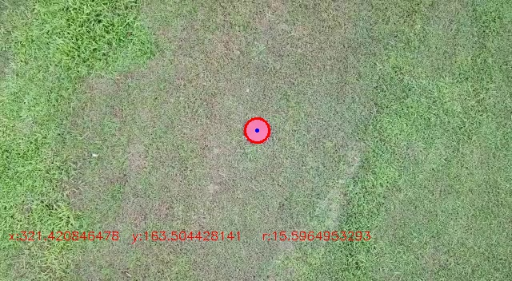
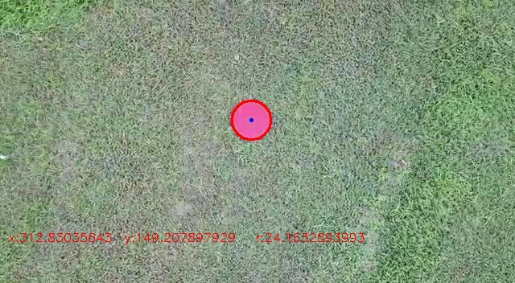
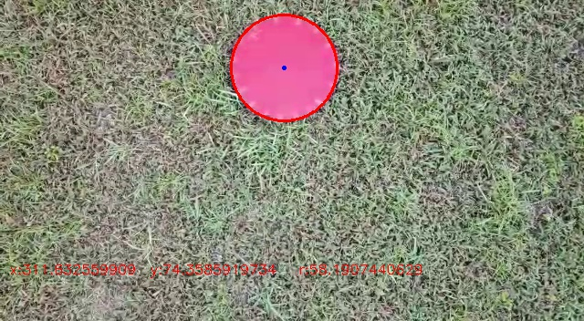

# Red Aerodrome Detection For Drones

This repository for red circle shape aerodrome detection for Drones. We supplied a demo script which can show result on given videos. We also supplied two different cases. You can easily test the project using these videos. In following figure, You can see 3 different detection results.

    
    
   

